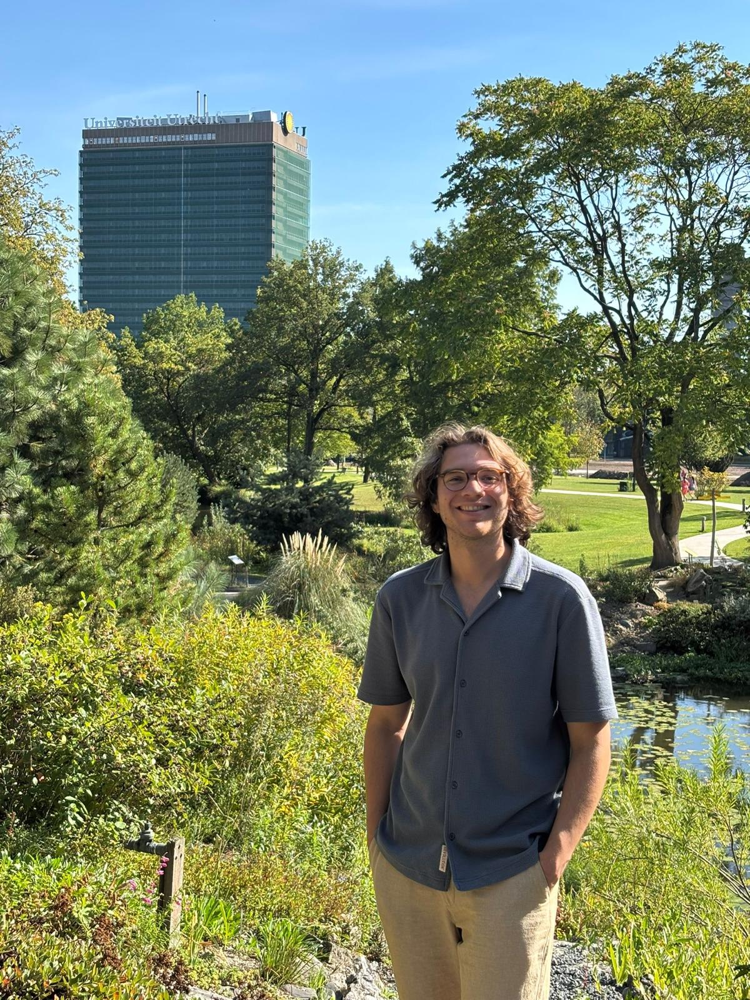
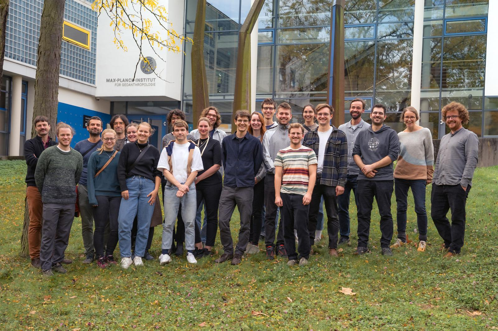
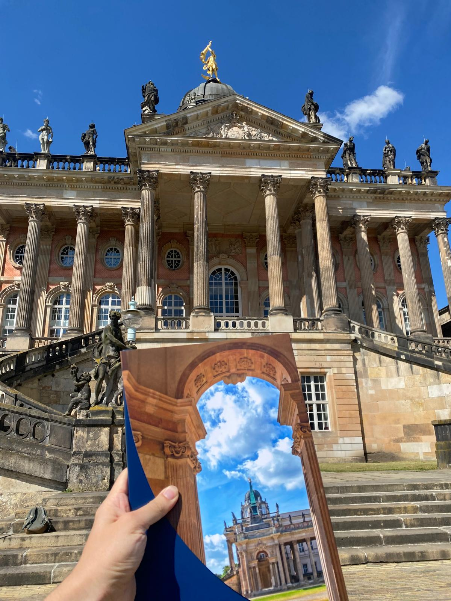
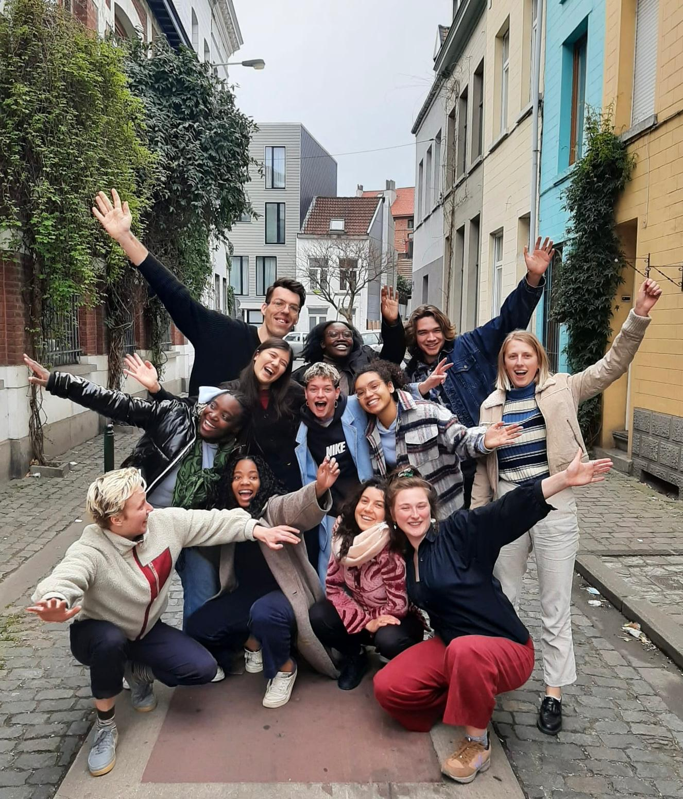
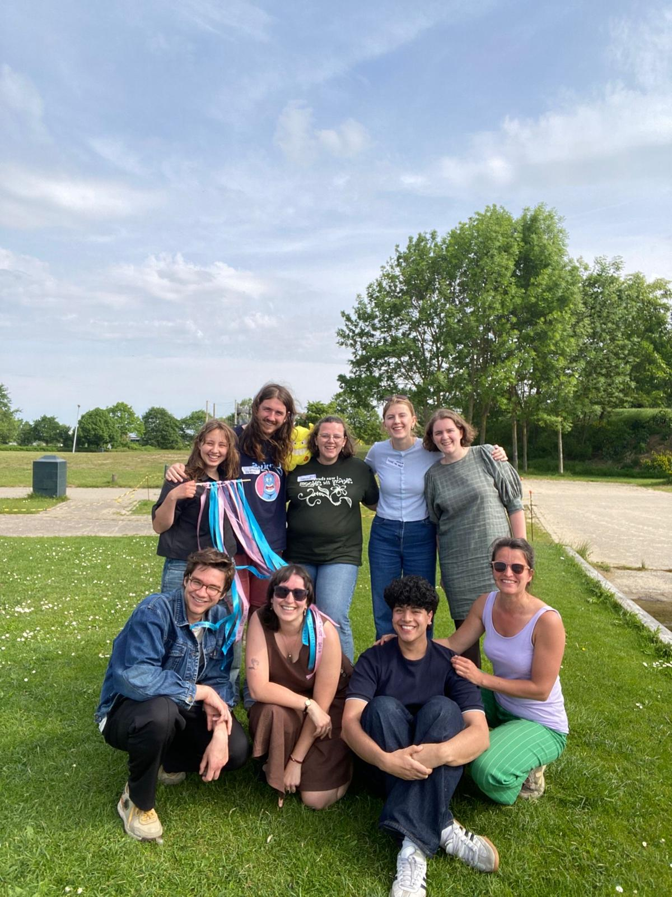

```{=html}
<style>
.cv-tag {
  display: inline-block;
  font-size: 0.68rem;
  font-weight: 600;
  text-transform: uppercase;
  letter-spacing: 0.07em;
  padding: 2px 9px;
  border-radius: 100px;
  margin-bottom: 0.45rem;
}
.cv-tag-experience      { background: #e1f5ee; color: #085041; }
.cv-tag-education       { background: #e6f1fb; color: #0c447c; }
.cv-tag-extracurricular { background: #faeeda; color: #633806; }

.cv-institution {
  font-size: 0.8rem;
  font-weight: 500;
  color: #c74310;
  margin-bottom: 0.2rem;
}

.cv-location {
  font-size: 0.78rem;
  color: #aaa;
  font-style: italic;
  margin-bottom: 0.35rem;
}

.cv-download {
  margin-bottom: 2rem;
}

.cv-download a {
  font-size: 0.82rem;
  font-weight: 500;
  color: #c74310;
  border: 1.5px solid #c74310;
  border-radius: 4px;
  padding: 0.35rem 0.85rem;
}

.cv-download a:hover {
  background: #c74310;
  color: #fffaf3;
}

.cv-skills {
  display: grid;
  grid-template-columns: 1fr 1fr;
  gap: 1.5rem 2rem;
  margin-top: 1rem;
  font-size: 0.85rem;
  color: #555;
  line-height: 1.65;
}

.cv-skills h4 {
  font-size: 0.78rem;
  font-weight: 600;
  text-transform: uppercase;
  letter-spacing: 0.07em;
  color: #aaa;
  margin: 0 0 0.35rem 0;
}

@media (max-width: 580px) {
  .cv-skills { grid-template-columns: 1fr; }
}
</style>

<div class="cv-download">
  <a href="CV.pdf" target="_blank">↓ Download full PDF</a>
</div>
```

## Experience

```{=html}
<div class="news-feed">

  <div class="news-item">
    <div class="news-date">
      <span class="news-month">2025</span>
      <span class="news-year">present</span>
    </div>
    <div class="news-content">
      <span class="cv-tag cv-tag-experience">Research</span>
      <h3>PhD Candidate — Interacting climate tipping elements</h3>
      <div class="cv-institution">Utrecht University · Copernicus Institute of Sustainable Development</div>
      <div class="cv-location">Utrecht, The Netherlands</div>
      <p>Studying the interaction between the Amazon rainforest and the AMOC as part of the <a href="https://embracer.nl/" target="_blank">EMBRACER</a> programme funded by the <a href= "https://www.nwo.nl/en/projects/summit1034/" target="_blank">NWO summit grant</a>. Supervised by Prof. Max Rietkerk and Prof. Henk Dijkstra; co-supervised by Dr. Arie Staal and Dr. Robbin Bastiaansen.</p>
      <div class="news-img">
  <div style="display:flex; gap:0.5rem;">
    
    
  </div>
</div>
    </div>
  </div>

  <div class="news-item">
    <div class="news-date">
      <span class="news-month">2023</span>
      <span class="news-year">2025</span>
    </div>
    <div class="news-content">
      <span class="cv-tag cv-tag-experience">Research</span>
      <h3>Student Research Assistant & intern/Msc.thesis</h3>
      <div class="cv-institution">Potsdam Institute for Climate Impact Research (PIK)</div>
      <div class="cv-location">Potsdam, Germany</div>
      <p>Student research assistant supervised by Dr. Cornelia Auer to evaluate Global Gridded Crop Models under climate extremes. Also worked at the <a href="https://www.pik-potsdam.de/en/institute/futurelabs-science-units/ersu/ersu" target="_blank">Earth Resilience Science Unit</a>, first as an intern on regenerative agriculture transitions, later completing my MSc thesis on <a href="https://github.com/tipmip-methods/toad/tree/v1.0.0" target="_blank">TOAD</a>, a pipeline for detecting abrupt shifts in Earth system model output.</p>
      <div class="news-img">
  
      </div>
    </div>
  </div>

  <div class="news-item">
    <div class="news-date">
      <span class="news-month">2023</span>
      <span class="news-year">2024</span>
    </div>
    <div class="news-content">
      <span class="cv-tag cv-tag-experience">Teaching</span>
      <h3>Tutor — Mathematics, Physics & Numerical Methods</h3>
      <div class="cv-institution">University of Potsdam</div>
      <div class="cv-location">Potsdam, Germany</div>
      <p>Weekly tutorials for first-year CLEWS students in "Mathematics and Physics for Earth Sciences" and "Numerical Methods (Programming)".</p>
    </div>
  </div>

  <div class="news-item">
    <div class="news-date">
      <span class="news-month">2022</span>
      <span class="news-year"></span>
    </div>
    <div class="news-content">
      <span class="cv-tag cv-tag-experience">Development</span>
      <h3>Open Course Developer</h3>
      <div class="cv-institution">University of Antwerp</div>
      <div class="cv-location">Antwerp, Belgium</div>
      <p>Adapted and structured existing statistics course material into an open course format using Quarto Books.</p>
    </div>
  </div>

  <div class="news-item">
    <div class="news-date">
      <span class="news-month">2021</span>
      <span class="news-year">2022</span>
    </div>
    <div class="news-content">
      <span class="cv-tag cv-tag-experience">Coordination</span>
      <h3>Living Lab Coordinator</h3>
      <div class="cv-institution">Green Office for KU Leuven</div>
      <div class="cv-location">Leuven, Belgium</div>
      <p>Advancing sustainability and transdisciplinarity in university education. Organised workshops, coordinated an international group of volunteers, and connected thesis students to NGOs across disciplines.</p>
    </div>
  </div>

</div>
```

## Education

```{=html}
<div class="news-feed">

  <div class="news-item">
    <div class="news-date">
      <span class="news-month">2022</span>
      <span class="news-year">2025</span>
    </div>
    <div class="news-content">
      <span class="cv-tag cv-tag-education">MSc</span>
      <h3>M.Sc. in Climate, Earth, Water and Sustainability (CLEWS)</h3>
      <div class="cv-institution">University of Potsdam</div>
      <div class="cv-location">Potsdam, Germany</div>
      <p>Interdisciplinary programme in collaboration with PIK, AWI, and UFZ. Thesis: <em>"Detect, Cluster, Aggregate: methods to study tipping in vegetation model output"</em>, completed at PIK under the supervision of Dr. Sina Loriani and Prof. Ricarda Winkelmann.</p>
      <div class="news-img">
  
      </div>
    </div>
  </div>

  <div class="news-item">
    <div class="news-date">
      <span class="news-month">2019</span>
      <span class="news-year">2022</span>
    </div>
    <div class="news-content">
      <span class="cv-tag cv-tag-education">BSc</span>
      <h3>B.Sc. in Geography — Magna Cum Laude</h3>
      <div class="cv-institution">KU Leuven</div>
      <div class="cv-location">Leuven, Belgium</div>
      <p>Minor (30 CP) in Mathematics and Physics. Thesis: <em>"Precipitation Extremes in Belgium"</em>. Voluntary tutor for "Spatial Data Analysis" and "Physical Geography". Honours programme: geomorphology of Vorsdonkbos, Aarschot.</p>
    </div>
  </div>

</div>
```

## Extracurricular

```{=html}
<div class="news-feed">

  <div class="news-item">
    <div class="news-date">
      <span class="news-month">2022</span>
      <span class="news-year"></span>
    </div>
    <div class="news-content">
      <span class="cv-tag cv-tag-extracurricular">Campaign</span>
      <h3>CHanGE — The Climate Edition</h3>
      <div class="cv-institution">University Centre for Development Cooperation (UCOS)</div>
      <div class="cv-location">Brussels, Belgium</div>
      <p>Research trip to Cairo to interview activists and organisations at the intersection of climate change, gender equality, and sexual health. Designed and executed the campaign <em>"Climate change as common ground"</em>.</p>
      <div class="news-img">
  
      </div>
    </div>
  </div>

  <div class="news-item">
    <div class="news-date">
      <span class="news-month">2019</span>
      <span class="news-year">present</span>
    </div>
    <div class="news-content">
      <span class="cv-tag cv-tag-extracurricular">Volunteering</span>
      <h3>Board Member & Ambassador</h3>
      <div class="cv-institution"><a href="https://www.youca.be/" target="_blank">YOUCA</a></div>
      <div class="cv-location">Brussels, Belgium</div>
      <p>Youth organisation striving for a sustainable and just society worldwide. Exchange to Guinea on sustainable youth entrepreneurship. Workshops and presentations for groups up to 250 young people.</p>
      <div class="news-img">
  
  </div>
    </div>
  </div>

  <div class="news-item">
    <div class="news-date">
      <span class="news-month">2017</span>
      <span class="news-year">present</span>
    </div>
    <div class="news-content">
      <span class="cv-tag cv-tag-extracurricular">Volunteering</span>
      <h3>Board Member & Volunteer</h3>
      <div class="cv-institution"><a href="https://www.globelink.be/" target="_blank">Globelink</a></div>
      <div class="cv-location">Brussels, Belgium</div>
      <p>Youth organisation focused on global sustainability and youth participation. Erasmus+ exchanges in Spain and Belgium.</p>
      <div class="news-img">
  
  </div>
    </div>
  </div>

</div>
```

## Skills

```{=html}
<div class="cv-skills">
  <div>
    <h4>Programming</h4>
    <p>R · Python · Julia · (R)Markdown · Quarto · LaTeX</p>
  </div>
  <div>
    <h4>Languages</h4>
    <p>
      Dutch — mother tongue<br>
      English — C1 (TOEFL 107)<br>
      French — B2<br>
      German — B1
    </p>
  </div>
</div>
```
