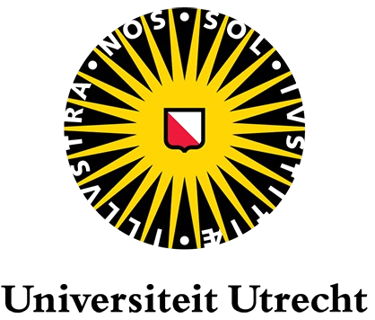
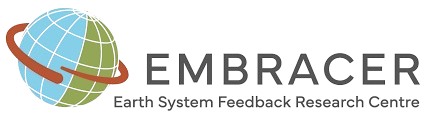
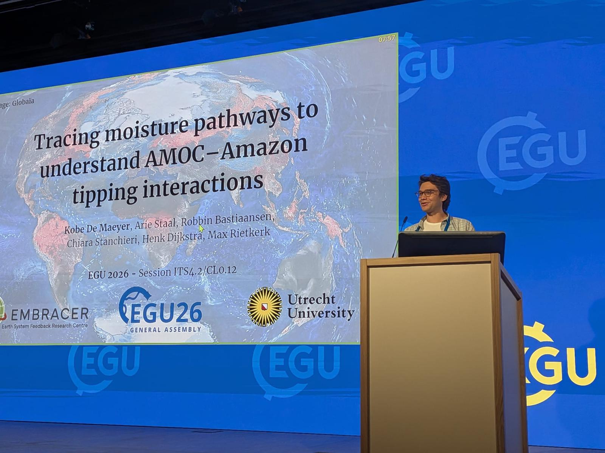
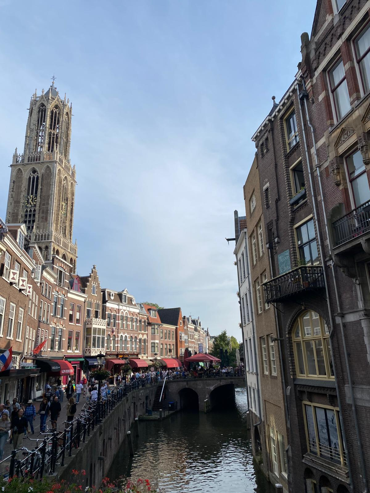

I'm a PhD candidate based in Utrecht, at the [Copernicus Institute of Sustainable Development](https://www.uu.nl/en/research/copernicus-institute-of-sustainable-development), studying Earth system resilience and (interacting) climate tipping points. I am supervised by [Prof. dr. ir. Max Rietkerk](https://www.uu.nl/medewerkers/MGRietkerk), [Dr. Arie Staal](https://www.uu.nl/medewerkers/AStaal), [Prof. dr. ir. Henk Dijkstra](https://www.uu.nl/medewerkers/HADijkstra) and [Dr. Robbin Bastiaansen](https://bastiaansen.github.io/home.html#general). In close collaboration with [Chiara Stanchieri](https://research-portal.uu.nl/en/persons/chiara-stanchieri/), another doctoral researcher hosted by [IMAU](https://www.uu.nl/en/research/institute-for-marine-and-atmospheric-research-imau), we investigate critical interactions between the Amazon rainforest and the Atlantic Meridional Overturning Circulation (AMOC). Our research is embedded within the [EMBRACER](https://embracer.nl/) consortium, a 10-year programme on Earth System feedbacks funded by the Summit grant from the Dutch Research Council NWO.


::: column-margin
{fig-align="center" width=50%}

<br><br>

{fig-align="center" width=80%}
:::


I hold a B.Sc. in Geography from [KU Leuven](https://www.kuleuven.be/opleidingen/bachelor-geowetenschappen) and a M.Sc. in Climate, Earth, Water, and Sustainability from the [University of Potsdam](https://www.uni-potsdam.de/de/umwelt/clews-masters-program). During my M.Sc. I worked as a research assistant and completed my thesis at the [Potsdam Institute for Climate Impact Research (PIK)](https://www.pik-potsdam.de/en).

Outside of science, I am active in [YOUCA](https://www.youca.be/) and [Globelink](https://www.globelink.be/), two Belgian youth organisations working on sustainability and global justice. I also enjoy writing (science/climate) fiction stories and engaging the public on climate risks, keep an eye on my [Science communication](scicomm.qmd) page for more on that. 


## 🗞 Latest news

```{=html}
<div class="news-feed news-feed-compact">

 <div class="news-item">
    <div class="news-date">
      <span class="news-month">May</span>
      <span class="news-year">2026</span>
    </div>
    <div class="news-content">
      <span class="news-tag news-tag-event">Event</span>
      <h3>EGU2026 General Assembly in Vienna</h3>
      <p> Presented <a href="https://meetingorganizer.copernicus.org/EGU26/EGU26-9787.html">my work</a> in the session, Earth resilience in the Anthropocene: from tipping points to planetary boundaries and human-Earth system interactions</p>
      <div class="news-img">
  
      </div>
    </div>
  </div>

  <div class="news-item">
    <div class="news-date">
      <span class="news-month">Sep</span>
      <span class="news-year">2025</span>
    </div>
    <div class="news-content">
      <span class="news-tag news-tag-milestone">Milestone</span>
      <h3>Started PhD at the Copernicus Institute, Utrecht University</h3>
      <p>Joined the <a href="https://embracer.nl/">EMBRACER consortium</a> as a doctoral researcher, working on AMOC–Amazon tipping interactions.</p>
      <div class="news-img">
  
      </div>
    </div>
  </div>

</div>
<p style="margin-top: 1rem;"><a href="news.html">See all news &amp; events →</a></p>
```
