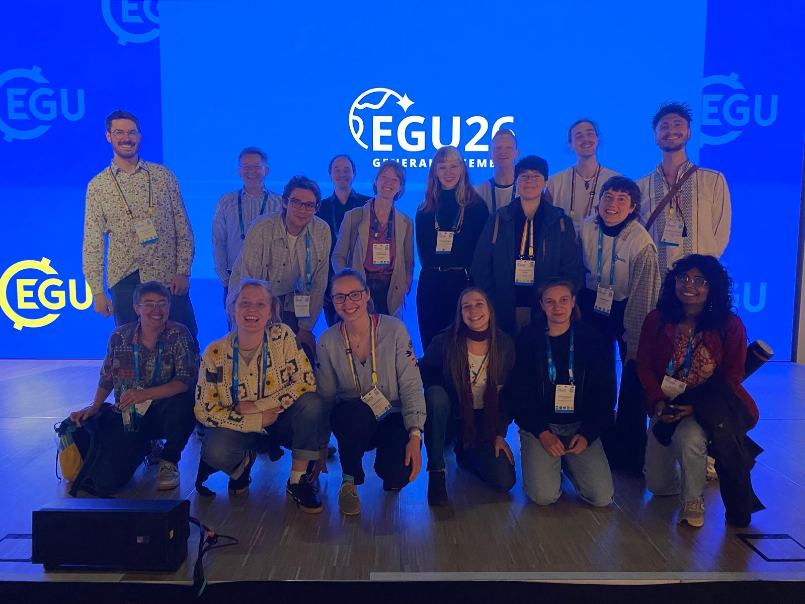
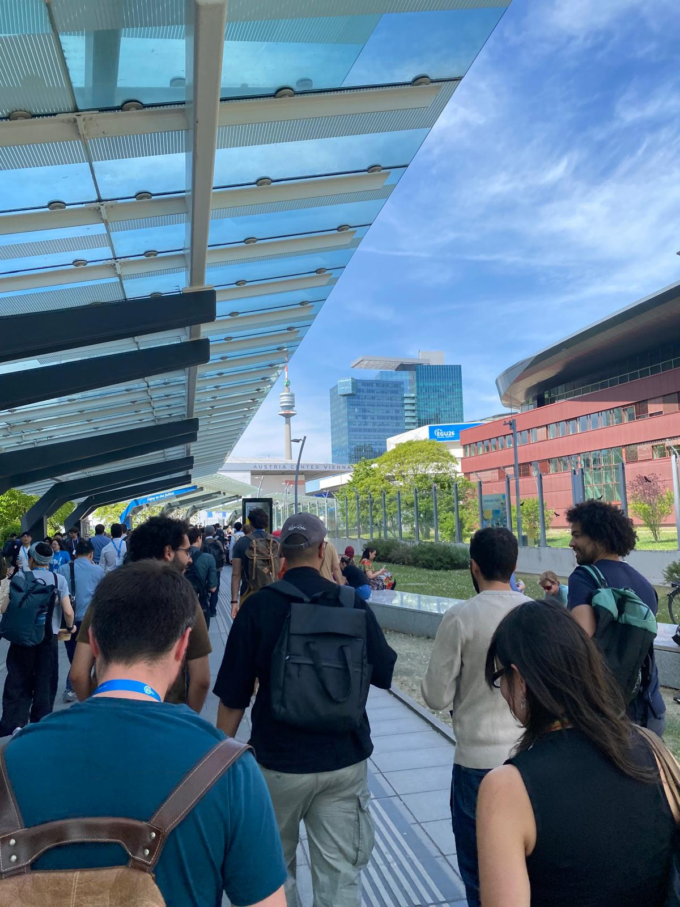

```{=html}
<!-- 
  POST TYPE OPTIONS for the scicomm card:
  data-type="phd"       → PhD life and research updates
  data-type="story"     → Fiction stories  
  data-type="explainer" → Explainers
  This post uses "phd".
-->
```

Vienna in May. Around 20,000 earth scientists in one massive conference complex for a week. Overwhelming for sure, stressful definitely, but at the same time a powerful reminder that this community exists, that it is enormous, and that the work matters. Perhaps now more than ever, when climate change has quietly slipped from the headlines, science funding is under threat, and the world's largest economy has decided to look the other way. This year's edition was the very first time for me at EGU, and by far not the last, I guess.

Thursday, I had the opportunity to present my work on "Tracing moisture pathways to understand AMOC-Amazon tipping interactions". Long story (well, actually only 8 minutes) short: what I showed is that under substantial AMOC[^1] weakening the internal moisture recycling feedback[^2] over the Amazon seems to rewire. Such a spatial reorganization of this crucial feedback may then fundamentally change the forest connectivity across the Amazon basin and the associated potential for cascading effects from large vegetation disturbances such as deforestation or extreme droughts. These are still preliminary results, but they hint that the interaction may be more nuanced than a simple "stabilising versus destabilising" story. I am very grateful for everyone who stayed around until 6pm for my talk and for all the inspiring discussions, ideas, and new grounds for collaboration.

[^1]: AMOC stands for "Atlantic Meridional Overturning Circulation": a large-scale ocean current system that, like a conveyor belt, moves warm Atlantic surface waters from the equator to the poles where they sink and return at higher depths to the south Atlantic. By doing so, it redistributes heat between the northern and southern hemisphere and is therefore crucial for the global climate system.

[^2]: The moisture recycling feedback, also called the rainfall-vegetation feedback, is one of the key mechanisms sustaining the Amazon rainforest. Trees release water vapour through their leaves, which rises, condenses, and falls again as rain, often hundreds of kilometres away. The forest, in other words, partly generates its own rain, linking distant parts of the basin into one deeply connected system. Studies suggest up to around 50% of Amazon rainfall is recycled this way. This means that large-scale deforestation does not just remove trees: it weakens the very mechanism that keeps the forest further downwind alive, affecting the system as a whole rather than just the local patches. 

Beyond the excitement of giving my first big conference presentation, EGU also meant 5 days of talks across sessions I would never normally encounter. Here are some of my personal take-aways I think should not just stay within the Earth system science community.

:::: {.columns}
::: {.column width="47%"}


:::
::: {.column width="53%"}

:::
::::

## Take-aways

-   **AMOC shutdown no longer a low likelihood event?** In an overcrowded room, Stefan Rahmstorf gave a solicited talk on ["AMOC tipping risk reconsidered"](https://meetingorganizer.copernicus.org/EGU26/EGU26-10486.html). His central message: in all climate models where @drijfhout2025 found an AMOC shutdown by 2300, AMOC strength had already dropped below 10 Sverdrups (Sv) by 2100, suggesting 10 Sv may act as a critical threshold beyond which weakening becomes self-reinforcing. @portmann2026, using observation-constrained model projections, estimated AMOC reaching \~8.1 Sv by 2100 under medium-to-high emissions, which would already breach that threshold. Whether 10 Sv truly marks a tipping point remains uncertain and actively debated, but the broader trend is clear: evidence has been steadily accumulating that an AMOC collapse is less unlikely than we once thought. The question is no longer whether to take this seriously, but how seriously.

-   **Climate models struggle with (tropical) land-atmosphere interactions.** Observational evidence shows tropical regions are getting drier, but our ability to project future change depends on models that can capture the underlying processes. Two talks from different sessions suggest they still can't sufficiently. [Andrew Chingos](https://meetingorganizer.copernicus.org/EGU26/EGU26-5957.html) showed that models systematically underestimate future tropical land drying, pointing to a fundamental gap in how land-atmosphere feedbacks are represented. [Dominick Spracklen](https://meetingorganizer.copernicus.org/EGU26/EGU26-19859.html) zoomed in on one key process: moisture recycling over tropical forests. Satellite data from 2001–2024 show clear precipitation declines downwind of deforested areas, yet models disagree sharply on the sign of the response, some even showing precipitation increases, others capturing a decline but likely for the wrong reasons.

-   **Deforestation and climate change are a more dangerous cocktail for the Amazon than previously thought.** Two talks in the tipping points session brought sobering new numbers. [Nico Wunderling](https://meetingorganizer.copernicus.org/EGU26/EGU26-4490.html) showed that without deforestation, Amazon stability only breaks down beyond \~3.7–4.0°C of warming, but combine 1.5–2.0°C with just 20–30% deforestation, then 62–77% of the remaining forest would transition to a degraded state [@wunderling2026]. [Lucas Ferreira Correa](https://meetingorganizer.copernicus.org/EGU26/EGU26-12025.html) isolated the compound effect using a comprehensive climate model: 25% deforestation alone stresses \~70% of the remaining forest, but adding 2°C of warming pushes that to 89%, more than what 50% deforestation causes on its own. The takeaway: the effects of deforestation and warming on the Amazon rainforest amplify each other nonlinearly.
