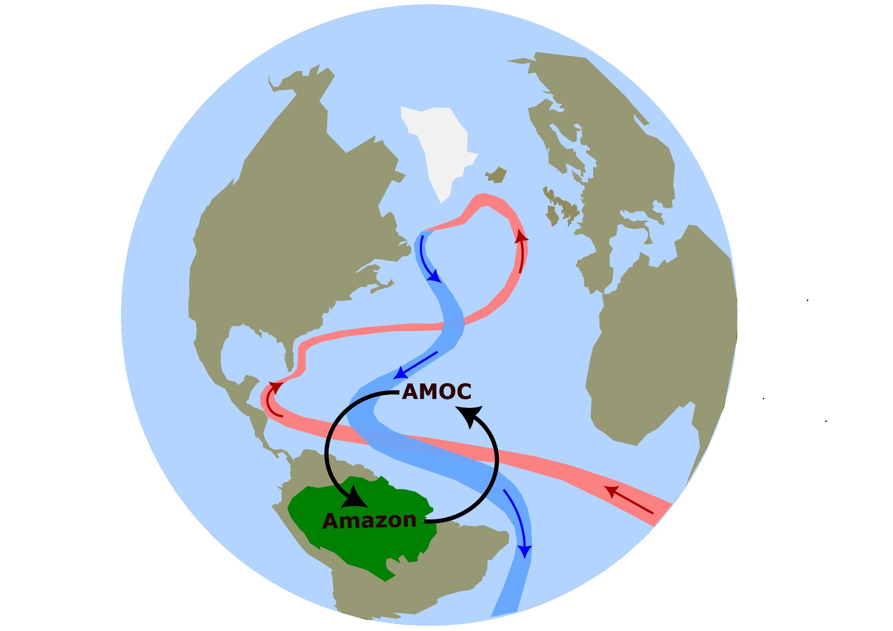

```{=html}
<div class="project-tag" style="margin-bottom:1rem;">PhD project · EMBRACER</div>
```

{style="width:100%; max-height:340px; object-fit:cover; border-radius:10px; margin-bottom:1.5rem;"}

## Overview


The Amazon rainforest and the Atlantic Meridional Overturning Circulation (AMOC) are widely recognised as two of Earth's major potential tipping elements: parts of the climate system that may shift abruptly and irreversibly into a different state through self-perpetuating feedback loops [@armstrongmckay2022; @lenton2023]. What makes them particularly interesting together is that they may not be independent: an AMOC weakening could alter atmospheric circulation patterns over tropical South America, changing how moisture is transported into the Amazon basin and thereby potentially affecting the stability of the rainforest system. Major forest disturbances, on the other hand, may also affect the AMOC through teleconnections. How these mechanisms interacts remains an open question [@wunderling2024].

My PhD focuses specifically on the **AMOC→Amazon pathway**. The Amazon does not just passively receive rainfall, it actively recycles moisture through evapotranspiration, sustaining its own precipitation through internal feedback loops [@staal2018; @zemp2017; @spracklen2012]. The key question is how AMOC-driven changes in moisture availability might alter these internal recycling dynamics, and whether they could change the connectivity between different parts of the basin. Could this make the Amazon as a whole more or less vulnerable to tipping under, for instance, large-scale deforestation pressure?


{style="width:70%; max-height:400px; object-fit:cover; border-radius:10px; margin-bottom:1.5rem;"}

## Approach


I work across a spectrum of model complexity. At the complex end, I use comprehensive climate models such as the Community Earth System Model (CESM) to study the effects of AMOC collapse on the Amazon basin, specifically, how the resulting changes in atmospheric circulation affect the Amazon's internal moisture recycling feedback. To isolate this response, I use a Lagrangian moisture tracking method (UTrack), which allows me to trace where precipitation over the Amazon actually originates and how recycling pathways shift under a weakened AMOC [@tuinenburg2020].

At the other end, stylized conceptual models, analyzed through the lens of dynamical systems theory, let me explore feedback mechanisms and their dynamics in much greater detail. Many experiments become possible: parameters can be varied, mechanisms isolated, and scenarios tested at low computational cost. Concretely, I use such models to combine insights from Earth System Model simulations, theory, and empirical data to evaluate the risks, uncertainties, and dynamics associated with Amazon tipping under a weakened AMOC and different deforestation scenarios, and whether changes in the Amazon could feed back on the AMOC itself.

## Funding and context


This project is funded by [EMBRACER](https://embracer.nl/), a 10-year Dutch research programme funded by the NWO summit grant focused on Earth system feedbacks. I am supervised by Prof. Max Rietkerk, Dr. Arie Staal, Prof. Henk Dijkstra, and Dr. Robbin Bastiaansen.


```{=html}
<div class="project-links" style="margin-top:2rem;">
  <a href="https://embracer.nl/" target="_blank">More on EMBRACER ↗</a>
</div>
```
