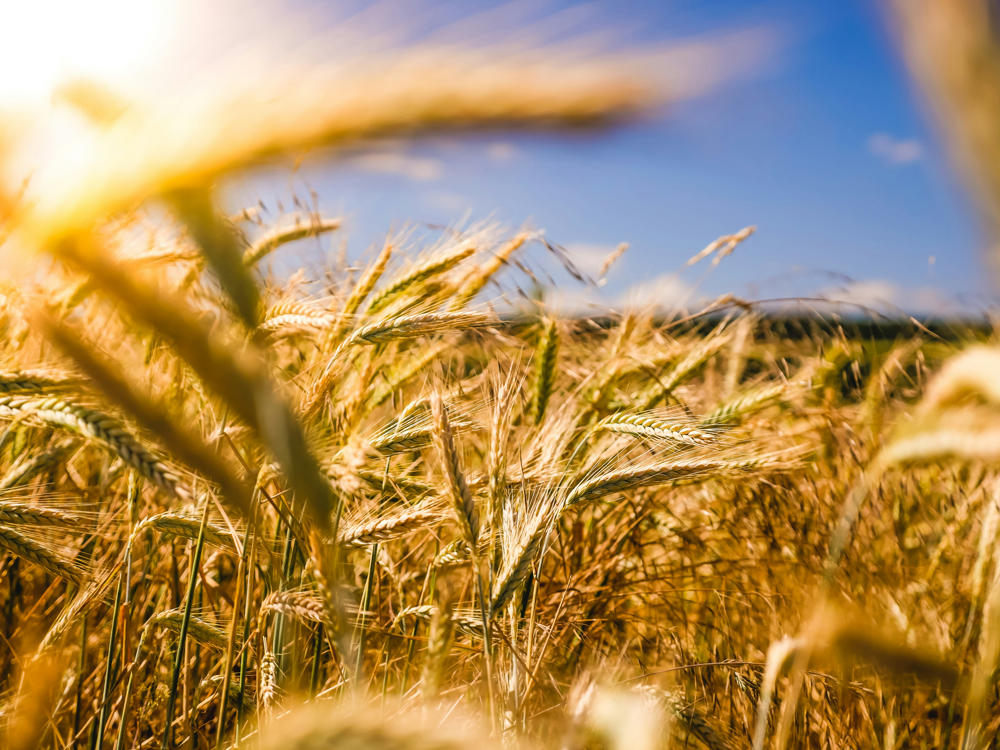

```{=html}
<div class="project-tag" style="margin-bottom:1rem;">Collaboration · ISIMIP & AgMIP</div>
```

{style="width:100%; max-height:340px; object-fit:cover; border-radius:10px; margin-bottom:1.5rem;"}

## Overview

<p style="text-align: justify;">

Global Gridded Crop Models (GGCMs) are among the key tools used to project how agricultural yields and food security may change under climate change. Their outputs inform policymakers and adaptation planners, which makes it important to understand how well they actually perform for their intended purposes, especially given the large uncertainty in their future projections [@rosenzweig2014].

Model intercomparison projects like [ISIMIP](https://www.isimip.org/) and [AgMIP](https://agmip.org/) create a rare opportunity for systematic assessment: by running multiple models under standardized protocols, they allow researchers to disentangle model uncertainty from forcing uncertainty, and to identify systematic biases or structural differences in how models represent crop responses.

This collaboration, which began during my time as a student assistant researcher at PIK, focuses on evaluating GGCM performance specifically under **climate extremes**, the conditions that drive tail risks for food systems and whose frequency and intensity are expected to rise under global warming. Because GGCMs are designed as global models and are used to inform food security policy worldwide, we evaluate performance across the full globe rather than focusing on major producing countries as most studies do. By doing so, we can probe whether model skill varies geographically and what that means for food security projections also in more climate-vulnerable regions that arguably need reliable projections most.

</p>

## Approach

<p style="text-align: justify;">

We assess how well GGCMs reproduce observed crop yield responses to heat stress, drought, and excessive rainfall, using ISIMIP simulation outputs and an observational benchmark. For the latter, we use a globally gridded product (GDHY; [@iizumi2020]) that combines (sub)national reports from FAO with remote sensing data, making it possible to evaluate model performance at the grid cell level on a global scale rather than at national or aggregate level. This comes with its own uncertainties that need to be taken into account, particularly in how well the benchmark itself reflects real-world yields.

</p>

## Status

<p style="text-align: justify;">

This is an ongoing collaboration with former colleagues at PIK. A paper is currently under review at *Nature Climate Change*. Stay tuned for further information on the methodology and results.

</p>

```{=html}
<div class="project-links" style="margin-top:2rem;">
  <a href="https://data.isimip.org/" target="_blank">ISIMIP website and repository ↗</a>
</div>
```
