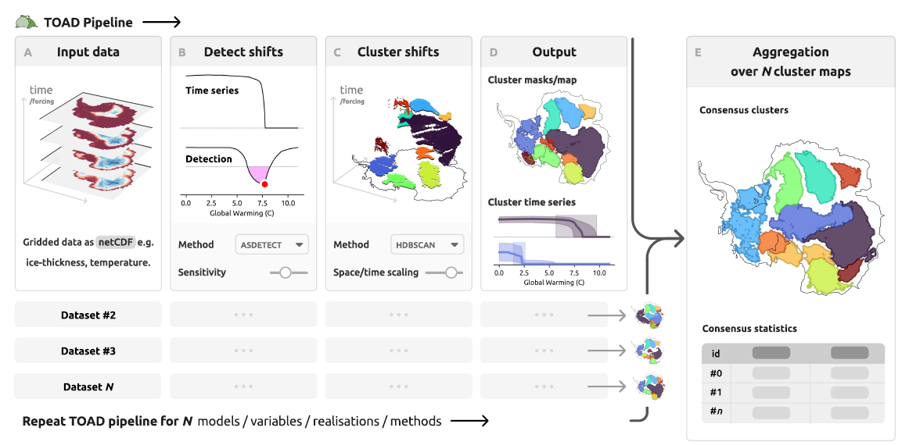

```{=html}
<div class="project-tag" style="margin-bottom:1rem;">MSc thesis · Open source tool</div>
```

{style="width:100%; max-height:340px; object-fit:cover; border-radius:10px; margin-bottom:1.5rem;"}

## Overview

Detecting tipping points and abrupt transitions in climate model output is methodologically challenging. Datasets from large model intercomparison projects are heterogeneous, often very large, and require methods that are robust, scalable, and consistently applicable across different models and variables. During my MSc thesis at the Potsdam Institute for Climate Impact Research (PIK), I contributed to developing **TOAD**: a modular, open-source Python pipeline designed to do exactly that.

TOAD provides a systematic framework for detecting and characterising abrupt shifts in Earth system data, designed to work across model intercomparison contexts like [TIPMIP](https://www.tipmip.org/). It helps researchers identify where and when abrupt changes occur across model ensembles, and compare those results in a consistent and reproducible way.


## Features

-   Modular pipeline architecture: each detection step is interchangeable
-   Designed for large, heterogeneous multi-model datasets
-   Supports detection of both temporal abrupt shifts and spatially coherent domains
-   Reproducible and version-controlled, with a public release at v1.0.0

## Status


TOAD v1.0.0 is publicly available on [GitHub](https://github.com/tipmip-methods/toad/tree/v1.0.0). A companion paper describing the framework has been submitted to *Geoscientific Model Development (GMD)* and is now out as [preprint.](https://egusphere.copernicus.org/preprints/2026/egusphere-2026-356/)


```{=html}
<div class="project-links" style="margin-top:2rem;">
  <a href="https://github.com/tipmip-methods/toad/tree/v1.0.0" target="_blank">Start working with TOAD ↗</a>
</div>
```
