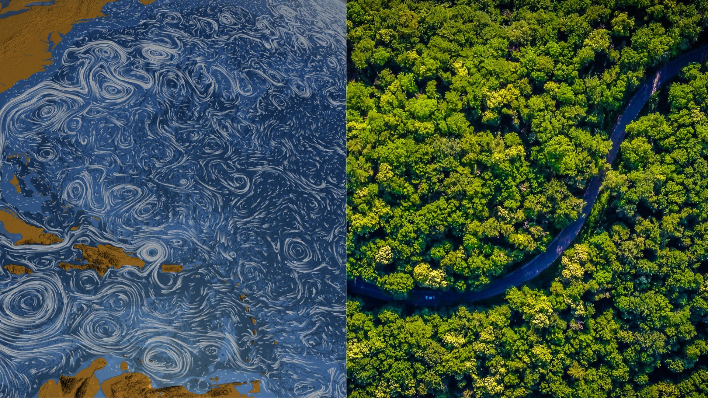

```{=html}
<div class="research-vision">
  <p>
    The Earth system is complex, nonlinear, and full of surprises, and I find that deeply fascinating, yet also worrying. Right now, we are running an uncontrolled climate experiment on a system we do not fully understand, with feedback loops that can rewire themselves in ways that are abrupt, far-reaching, and difficult to reverse. My research sits at the intersection of climate tipping points, feedback mechanisms, and the uncertainties that emerge when different parts of the Earth system interact.
  </p>
  <p>
  To study this, I work across the Climate Model Hierarchy: from comprehensive Earth System Models to stylised conceptual approaches, using a combination of mathematical, numerical, and data analysis methods. Wisely combining these levels of complexity is how I try to build a truthful picture of the risks we are actually facing, and understand a system that will keep surprising us.
  </p>
</div>


<div class="interest-pills">
  <span class="interest-pill">Tipping points</span>
  <span class="interest-pill">Interaction & feedback mechanisms</span>
  <span class="interest-pill">Earth system & ecosystem resilience</span>
  <span class="interest-pill">Dynamical systems theory</span>
  <span class="interest-pill">Complex systems</span>
  <span class="interest-pill">Network analysis</span>
  <span class="interest-pill">Multivariate & multimodel approaches</span>
  <span class="interest-pill">Uncertainty quantification</span>
  <span class="interest-pill">Bayesian inference</span>
</div>
```

## Projects

```{=html}
<div class="project-grid">

  <!-- PROJECT CARD
       To add a background image, set the style attribute on .project-card like this:
       <div class="project-card has-bg" style="--card-bg: url('images/your-photo.jpg')">
       Without an image, just use: <div class="project-card"> -->

  <a class="project-card card-with-header-img" href="projects/amoc-amazon.html">
    
    <div class="card-inner">
      <div class="project-tag">PhD project · EMBRACER</div>
      <h3>The interaction between the Amazon rainforest and the AMOC</h3>
      <p>The Amazon rainforest and the Atlantic Meridional Overturning Circulation (AMOC) are identified as two potential climate tipping elements that may also interact. My PhD focuses on the AMOC→Amazon pathway: how AMOC weakening may alter the Amazon's internal moisture recycling feedback, changing how different parts of the basin are connected to each other.</p>
      <div class="project-links" style="margin-top:auto; padding-top:0.5rem;">
        Read more ↗
      </div>
    </div>
  </a>

  <a class="project-card card-with-header-img" href="projects/toad.html">
    
    <div class="card-inner">
      <div class="project-tag">MSc thesis · Open source tool</div>
      <h3>TOAD: Tipping and Other Abrupt events Detector</h3>
      <p>During my MSc thesis at PIK, I contributed to developing TOAD, a modular and open-source pipeline for detecting abrupt transitions and tipping dynamics in complex Earth system datasets, designed to work across model intercomparison contexts like TIPMIP.</p>
      <div class="project-links" style="margin-top:auto; padding-top:0.5rem;">
        Read more ↗
      </div>
    </div>
  </a>

  <a class="project-card card-with-header-img" href="projects/crop-models.html">
    
    <div class="card-inner">
      <div class="project-tag">Collaboration · ISIMIP & AgMIP</div>
      <h3>Evaluating crop model performance under climate extremes</h3>
      <p>An ongoing collaboration evaluating how well Global Gridded Crop Models reproduce crop responses under climate extremes, using ISIMIP and AgMIP intercomparison data. Started during my time as a student assistant researcher at PIK.</p>
      <div class="project-links" style="margin-top:auto; padding-top:0.5rem;">
        Read more ↗
      </div>
    </div>
  </a>

</div>
```

## Publications

```{=html}
<div class="pub-list">

  <!-- Add publications here. Copy a .pub-item block for each new paper. -->

  <div class="pub-item">
    <div class="pub-main">
      <div class="pub-title">(preprint) TOAD v1. 0: A Python Framework for Detecting Abrupt Shifts and Coherent Spatial Domains in Earth-System Data</div>
      <div class="pub-authors">Jakob Harteg, Lukas Röhrich, Kobe De Maeyer, Julius Garbe, Boris Sakschewski, Ann Kristin Klose, Jonathan F Donges, Ricarda Winkelmann, Sina Loriani. &middot; <em>submitted to Geoscientific Model Development (GMD)</em></div>
      <div class="pub-explainer">TOAD is a software tool that helps scientists find and compare abrupt shifts in climate model data making it easier to identify where and when parts of the Earth system might be approaching a tipping point.</div>
    </div>
    <div class="pub-year">2026</div>
  </div>

</div>
```
